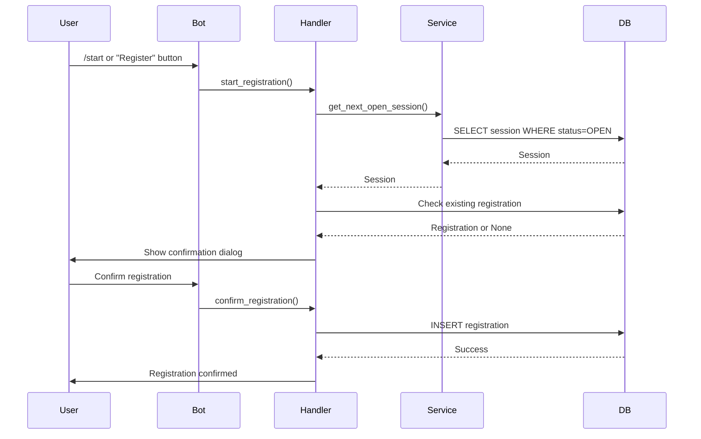
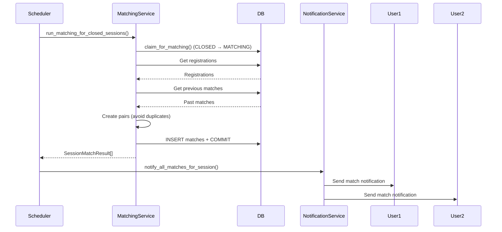
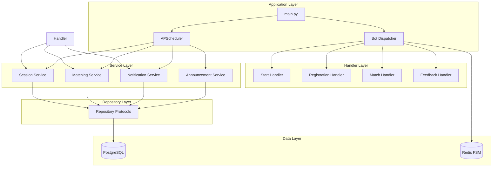
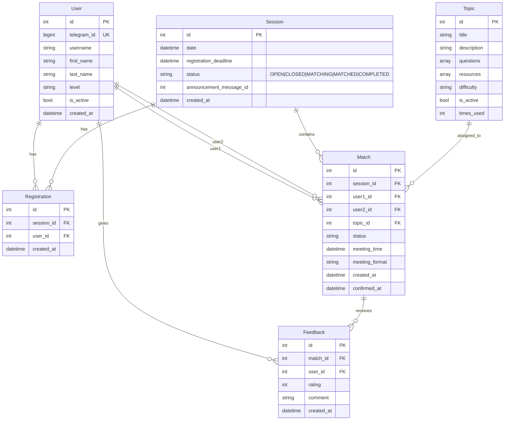

# Random Coffee Bot - Architecture

## System Overview

Random Coffee Bot is a Telegram bot for organizing random meetings between community members. The bot automatically creates pairs, assigns discussion topics, and manages the registration process.

## Architecture Diagrams

### Registration Data Flow



### Match Creation Flow



### Component Architecture



## Data Model

### ER Diagram



## Core Components

### 1. Handlers (`app/bot/handlers/`)

Handlers for user commands and callbacks.

**Usage Example:**

```python
# app/bot/handlers/registration.py
@router.callback_query(F.data == "register")
async def start_registration(
    callback: CallbackQuery,
    session: AsyncSession,
    state: FSMContext
) -> None:
    """Handle registration button click."""
    # Get the next open session
    next_session = await get_next_open_session(session)

    # Check for existing registration
    # Show confirmation
    # Save registration
```

### 2. Services (`app/services/`)

Business logic of the application. Services are functions that accept repositories via protocols (dependency injection). Concrete repository implementations are created at the calling code level (handlers, scheduler).

**Usage Example:**

```python
# app/services/matching.py
async def create_matches_for_session(
    session_id: int,
    session_repo: SessionRepositoryProtocol,
    registration_repo: RegistrationRepositoryProtocol,
    match_repo: MatchRepositoryProtocol,
    topic_repo: TopicRepositoryProtocol,
) -> tuple[int, list[int]]:
    """Create random matches for a session."""
    ...
```

**Call from scheduler (creating repositories):**

```python
async with async_session_maker() as db_session:
    session_repo = SessionRepository(db_session)
    registration_repo = RegistrationRepository(db_session)
    match_repo = MatchRepository(db_session)
    topic_repo = TopicRepository(db_session)

    result = await create_matches_for_session(
        session_id, session_repo, registration_repo,
        match_repo, topic_repo,
    )
```

### 3. Models (`app/models/`)

SQLAlchemy models for working with the database.

**Usage Example:**

```python
# app/models/match.py
class Match(Base):
    """Matched pair of users."""
    __tablename__ = "matches"

    id: Mapped[int] = mapped_column(primary_key=True)
    session_id: Mapped[int] = mapped_column(ForeignKey("sessions.id"))
    user1_id: Mapped[int] = mapped_column(ForeignKey("users.id"))
    user2_id: Mapped[int] = mapped_column(ForeignKey("users.id"))
    topic_id: Mapped[int | None] = mapped_column(ForeignKey("topics.id"))
    status: Mapped[str] = mapped_column(String(50))
```

### 4. Middlewares (`app/bot/middlewares/`)

Middleware for processing requests.

- `DatabaseMiddleware` — provides `AsyncSession` for each request
- `ThrottlingMiddleware` — limits the frequency of requests (created in `get_dispatcher()` for explicit lifecycle management)


## Matching Algorithm

### Pseudocode

```python
async def create_matches(session_id: int) -> tuple[int, list[int]]:
    # 1. Get all registrations for the session
    registrations = get_registrations(session_id)

    if len(registrations) < 2:
        return 0, [r.user_id for r in registrations]

    # 2. Get previous matches to avoid duplicates
    user_ids = [r.user_id for r in registrations]
    past_matches = get_previous_matches(user_ids)

    # 3. Shuffle users
    pool = list(registrations)
    random.shuffle(pool)

    matches = []

    # 4. Handle odd-sized group: form a triplet from the last 3 users.
    #    All 6 permutations of the same 3 users produce identical pairs,
    #    so there is no "best" ordering — just check for existing repeats
    #    for logging purposes and create the triplet.
    if len(pool) % 2 == 1 and len(pool) >= 3:
        u1, u2, u3 = pool.pop(), pool.pop(), pool.pop()
        topic = select_topic_for_users(u1.user_id, u2.user_id, u3.user_id)
        match = create_triple_match(u1, u2, u3, topic)
        matches.append(match)

    # 5. Greedy pair matching: for each user, try to find a partner
    #    they haven't met before. If all remaining candidates are
    #    repeats, pair with the first available one.
    while len(pool) >= 2:
        u1 = pool.pop()
        partner = find_fresh_partner(u1, pool, past_matches)
        if partner is None:
            partner = pool[0]  # fallback: pair despite previous meeting

        pool.remove(partner)
        topic = select_topic_for_users(u1.user_id, partner.user_id)
        match = create_match(u1, partner, topic)
        matches.append(match)

    # 6. Return the result
    unmatched = [u.user_id for u in pool]
    return len(matches), unmatched
```

## Configuration

### Environment Variables

All settings are managed via environment variables (see `.env.example`):

- `TELEGRAM_BOT_TOKEN` - bot token from @BotFather
- `DATABASE_URL` - PostgreSQL connection string
- `REDIS_URL` - Redis connection string
- `LOG_LEVEL` - logging level (DEBUG, INFO, WARNING, ERROR)
- `LOG_FORMAT` - logging format (text, json)

### Logging Configuration

```python
# Structured logging (JSON) for production
LOG_FORMAT=json

# Text logging for development
LOG_FORMAT=text
```

## Task Scheduler

### Schedule

The schedule is configured via constants in `app/constants.py` (day of week, hour,
minute offsets). The actual triggers are built in `setup_scheduler()` using
`CronTrigger` with values from constants.

```python
# Weekly session creation + channel announcement
scheduler.add_job(
    create_and_announce_session,
    CronTrigger(day_of_week=SESSION_CREATION_DAY, hour=SESSION_CREATION_HOUR,
                minute=SESSION_CREATION_MINUTE, timezone="UTC"),
    id="create_weekly_session",
)

# Hourly — close registrations for expired sessions
scheduler.add_job(
    close_registration_for_expired_sessions,
    CronTrigger(minute=REGISTRATION_CLOSE_CHECK_MINUTE, timezone="UTC"),
    id="close_registrations",
)

# Hourly — run matching and send notifications
scheduler.add_job(
    match_and_notify,
    CronTrigger(minute=MATCHING_CHECK_MINUTE, timezone="UTC"),
    id="run_matching",
)
```

The scheduler acts as an orchestrator: `match_and_notify` calls
`run_matching_for_closed_sessions()` (pure data logic), and then sends
notifications via `notify_all_matches_for_session()`. This keeps the matching
service independent of the Telegram API.

### Scaling note

The bot uses long polling (`await dp.start_polling(bot)`), which means
Telegram delivers updates to a single consumer. Running multiple bot instances
with long polling **will not** horizontally scale message processing — one
instance receives all updates. For multi-instance deployments, switch to
webhooks behind a load balancer, and add a unique constraint on
`Session.date` to prevent duplicate session creation by concurrent scheduler
jobs.

## Security

### Input Data Validation

All callback data is validated via Pydantic schemas:

```python
from app.schemas.callbacks import parse_callback_data

callback_data = parse_callback_data(callback.data)
# Raises ValueError if invalid
```

### Error Handling

- All exceptions are logged with full context
- `logger.exception()` is used for tracing
- Retry logic for transient Telegram API errors

### SQL Injection Protection

- All SQL queries go through SQLAlchemy ORM
- Parameterized queries for raw SQL

## Monitoring

### Logging

The application uses structured logging for monitoring:

- **JSON format** for production (easily parsed by logging systems)
- **Text format** for development (convenient to read)
- **Logging levels** (DEBUG, INFO, WARNING, ERROR)

### Heartbeat File

The application creates a heartbeat file (`/tmp/healthy` by default) to check health status. The file is updated every 15 seconds.

This allows orchestrators (Docker, Kubernetes) to check the application's state without needing a separate HTTP server.

## Deployment

### Docker

```bash
# Development
docker-compose up -d

# Production
docker-compose -f docker-compose.prod.yml up -d
```

### Migrations

```bash
# Apply migrations
alembic upgrade head

# Create a new migration
alembic revision --autogenerate -m "description"
```

## Testing

### Running Tests

```bash
# All tests
pytest

# With coverage
pytest --cov=app --cov-report=html

# Specific file
pytest tests/unit/test_matching_functions.py
```

### Coverage

Coverage is tracked via the badge in README, generated from
the full test suite (unit + integration) in CI.

## API Usage Examples

### Session Creation

```python
from app.repositories.session import SessionRepository

session_repo = SessionRepository(db_session)
session = await create_weekly_session(session_repo)
```

### Match Creation

```python
from app.repositories.match import MatchRepository
from app.repositories.registration import RegistrationRepository
from app.repositories.session import SessionRepository
from app.repositories.topic import TopicRepository

session_repo = SessionRepository(db_session)
registration_repo = RegistrationRepository(db_session)
match_repo = MatchRepository(db_session)
topic_repo = TopicRepository(db_session)

matches_count, unmatched = await create_matches_for_session(
    session_id=1,
    session_repo=session_repo,
    registration_repo=registration_repo,
    match_repo=match_repo,
    topic_repo=topic_repo,
)
```

### Sending Notifications

```python
from app.repositories.match import MatchRepository
from app.repositories.user import UserRepository

match_repo = MatchRepository(db_session)
user_repo = UserRepository(db_session)

success = await notify_all_matches_for_session(
    bot, session_id=1, match_repo=match_repo, user_repo=user_repo
)
```

## Extending Functionality

### Adding a new handler

1. Create a file in `app/bot/handlers/`
2. Define router and handlers
3. Register the router in `app/bot/__init__.py`

### Adding a new migration

```bash
alembic revision --autogenerate -m "add new field"
# Check the generated migration
alembic upgrade head
```

## Performance

### Optimizations

- Indexes on frequently queried fields
- Connection pooling for the database
- Retry logic for API calls
- Asynchronous processing of all operations

### Scaling

- Horizontal scaling via webhooks (see Scaling note above)
- Redis for shared FSM state
- PostgreSQL for reliable data storage
