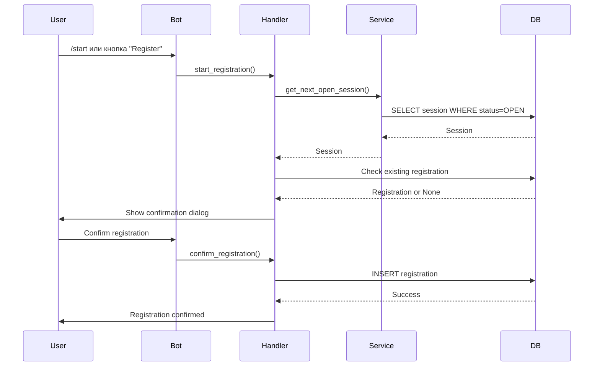
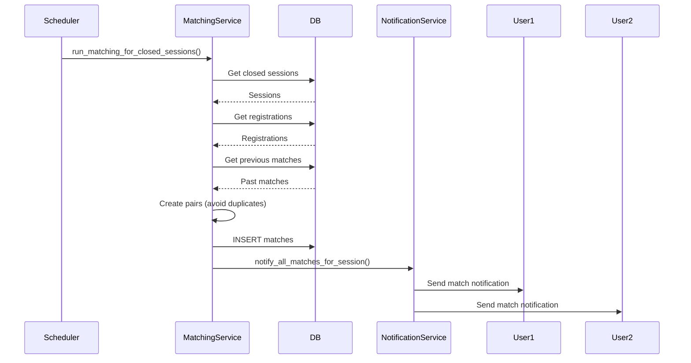
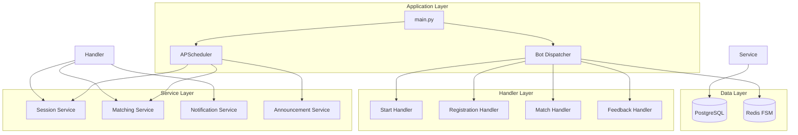
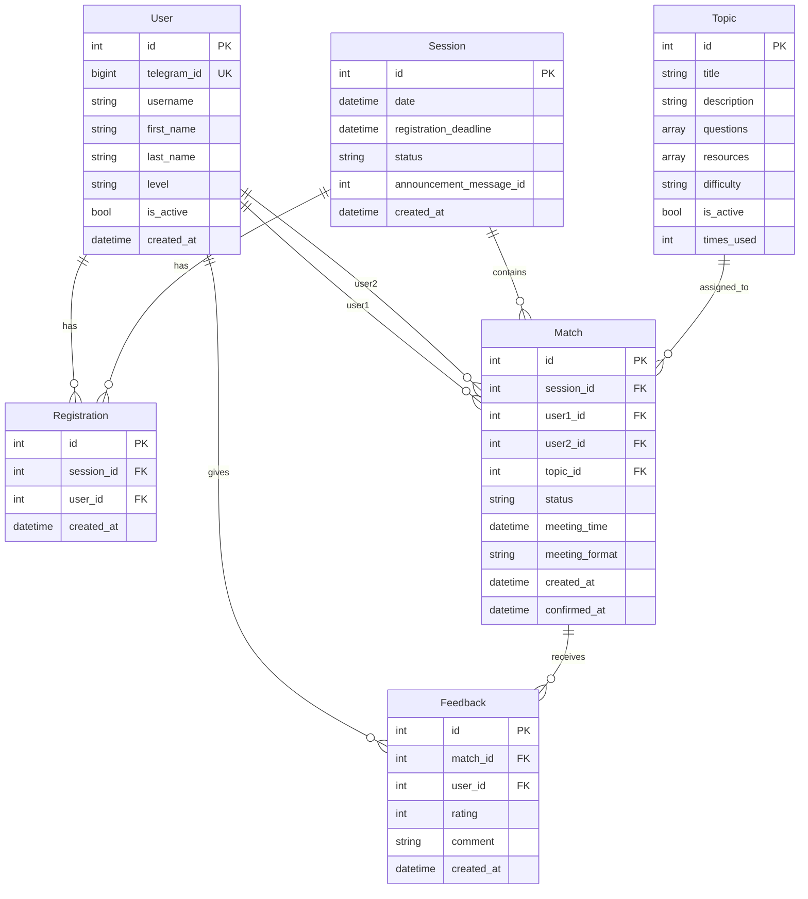

# Random Coffee Bot - Архитектура

## Обзор системы

Random Coffee Bot - это Telegram бот для организации случайных встреч между участниками сообщества. Бот автоматически создает пары, назначает темы для обсуждения и управляет процессом регистрации.

## Архитектурные диаграммы

### Поток данных при регистрации



### Поток создания матчей



### Компонентная архитектура



## Модель данных

### ER-диаграмма



## Основные компоненты

### 1. Handlers (`app/bot/handlers/`)

Обработчики пользовательских команд и callback'ов.

**Пример использования:**

```python
# app/bot/handlers/registration.py
@router.callback_query(F.data == "register")
async def start_registration(
    callback: CallbackQuery,
    session: AsyncSession,
    state: FSMContext
) -> None:
    """Handle registration button click."""
    # Получить следующую открытую сессию
    next_session = await get_next_open_session(session)

    # Проверить существующую регистрацию
    # Показать подтверждение
    # Сохранить регистрацию
```

### 2. Services (`app/services/`)

Бизнес-логика приложения.

**Пример использования:**

```python
# app/services/matching.py
async def create_matches_for_session(
    session_id: int,
    db_session: AsyncSession | None = None
) -> tuple[int, list[int]]:
    """Create random matches for a session.

    Returns:
        Tuple of (matches_created, unmatched_user_ids)
    """
    # Получить регистрации
    # Получить предыдущие матчи
    # Создать пары (избегая дубликатов)
    # Назначить темы
    # Вернуть результат
```

### 3. Models (`app/models/`)

SQLAlchemy модели для работы с БД.

**Пример использования:**

```python
# app/models/match.py
class Match(Base):
    """Matched pair of users."""
    __tablename__ = "matches"

    id: Mapped[int] = mapped_column(primary_key=True)
    session_id: Mapped[int] = mapped_column(ForeignKey("sessions.id"))
    user1_id: Mapped[int] = mapped_column(ForeignKey("users.id"))
    user2_id: Mapped[int] = mapped_column(ForeignKey("users.id"))
    topic_id: Mapped[int | None] = mapped_column(ForeignKey("topics.id"))
    status: Mapped[str] = mapped_column(String(50))
```

### 4. Middlewares (`app/bot/middlewares/`)

Промежуточное ПО для обработки запросов.

**Примеры:**
- `DatabaseMiddleware` - предоставляет сессию БД для каждого запроса
- `ThrottlingMiddleware` - ограничивает частоту запросов


## Алгоритм матчинга

### Псевдокод

```python
async def create_matches(session_id: int) -> tuple[int, list[int]]:
    # 1. Получить все регистрации для сессии
    registrations = get_registrations(session_id)

    if len(registrations) < 2:
        return 0, [r.user_id for r in registrations]

    # 2. Получить предыдущие матчи для избежания дубликатов
    user_ids = [r.user_id for r in registrations]
    past_matches = get_previous_matches(user_ids)

    # 3. Перемешать пользователей
    pool = list(registrations)
    random.shuffle(pool)

    matches = []

    # 4. Greedy matching с избежанием дубликатов
    while len(pool) >= 2:
        u1 = pool.pop()

        # Найти совместимого партнера
        partner = find_fresh_partner(u1, pool, past_matches)

        if partner:
            # Создать матч
            topic = select_topic_for_users(u1.user_id, partner.user_id)
            match = create_match(u1, partner, topic)
            matches.append(match)
            pool.remove(partner)
        else:
            # Если все пары уже встречались, создать матч все равно
            if len(pool) > 0:
                partner = pool.pop()
                create_match(u1, partner, topic)

    # 5. Вернуть результат
    unmatched = [u.user_id for u in pool]
    return len(matches), unmatched
```

## Конфигурация

### Переменные окружения

Все настройки через переменные окружения (см. `.env.example`):

- `TELEGRAM_BOT_TOKEN` - токен бота от @BotFather
- `DATABASE_URL` - строка подключения к PostgreSQL
- `REDIS_URL` - строка подключения к Redis
- `LOG_LEVEL` - уровень логирования (DEBUG, INFO, WARNING, ERROR)
- `LOG_FORMAT` - формат логов (text, json)

### Настройка логирования

```python
# Структурированное логирование (JSON) для продакшена
LOG_FORMAT=json

# Текстовое логирование для разработки
LOG_FORMAT=text
```

## Планировщик задач

### Расписание

```python
# Каждый понедельник в 10:00 UTC
scheduler.add_job(
    create_and_announce_session,
    CronTrigger(day_of_week="mon", hour=10, minute=0, timezone="UTC"),
    id="create_weekly_session"
)

# Каждый час в :00
scheduler.add_job(
    close_registration_for_expired_sessions,
    CronTrigger(minute=0, timezone="UTC"),
    id="close_registrations"
)

# Каждый час в :15
scheduler.add_job(
    run_matching_for_closed_sessions,
    CronTrigger(minute=15, timezone="UTC"),
    id="run_matching"
)
```

## Безопасность

### Валидация входных данных

Все callback данные валидируются через Pydantic схемы:

```python
from app.schemas.callbacks import parse_callback_data

callback_data = parse_callback_data(callback.data)
# Raises ValueError if invalid
```

### Обработка ошибок

- Все исключения логируются с полным контекстом
- Используется `logger.exception()` для трейсинга
- Retry логика для транзиентных ошибок Telegram API

### SQL Injection защита

- Все SQL запросы через SQLAlchemy ORM
- Параметризованные запросы для raw SQL

## Мониторинг

### Логирование

Приложение использует структурированное логирование для мониторинга:

- **JSON формат** для продакшена (легко парсится системами логирования)
- **Текстовый формат** для разработки (удобно читать)
- **Correlation IDs** для отслеживания запросов
- **Уровни логирования** (DEBUG, INFO, WARNING, ERROR)

### Heartbeat файл

Приложение создает heartbeat файл (`/tmp/healthy` по умолчанию) для проверки работоспособности. Файл обновляется каждые 15 секунд.

Это позволяет оркестраторам (Docker, Kubernetes) проверять состояние приложения без необходимости в отдельном HTTP сервере.

## Развертывание

### Docker

```bash
# Development
docker-compose up -d

# Production
docker-compose -f docker-compose.prod.yml up -d
```

### Миграции

```bash
# Применить миграции
alembic upgrade head

# Создать новую миграцию
alembic revision --autogenerate -m "description"
```

## Тестирование

### Запуск тестов

```bash
# Все тесты
pytest

# С покрытием
pytest --cov=app --cov-report=html

# Конкретный файл
pytest tests/unit/test_matching.py
```

### Покрытие

Минимальное покрытие: 80% (проверяется в CI)

## Примеры использования API

### Создание сессии

```python
from app.services.sessions import create_weekly_session

session = await create_weekly_session()
# Создает сессию на следующую пятницу в 10:00 UTC
```

### Создание матчей

```python
from app.services.matching import create_matches_for_session

matches_count, unmatched = await create_matches_for_session(session_id=1)
# Возвращает (количество_матчей, [список_несовмещенных_пользователей])
```

### Отправка уведомлений

```python
from app.services.notifications import send_match_notification

success = await send_match_notification(bot, match_id=1)
# Отправляет уведомление обоим пользователям в паре
```

## Расширение функциональности

### Добавление нового handler

1. Создать файл в `app/bot/handlers/`
2. Определить router и handlers
3. Зарегистрировать router в `app/bot/__init__.py`

### Добавление новой миграции

```bash
alembic revision --autogenerate -m "add new field"
# Проверить сгенерированную миграцию
alembic upgrade head
```

## Производительность

### Оптимизации

- Индексы на часто запрашиваемые поля
- Connection pooling для БД
- Retry логика для API вызовов
- Асинхронная обработка всех операций

### Масштабирование

- Горизонтальное масштабирование через несколько инстансов бота
- Redis для разделения FSM состояния
- PostgreSQL для надежного хранения данных
